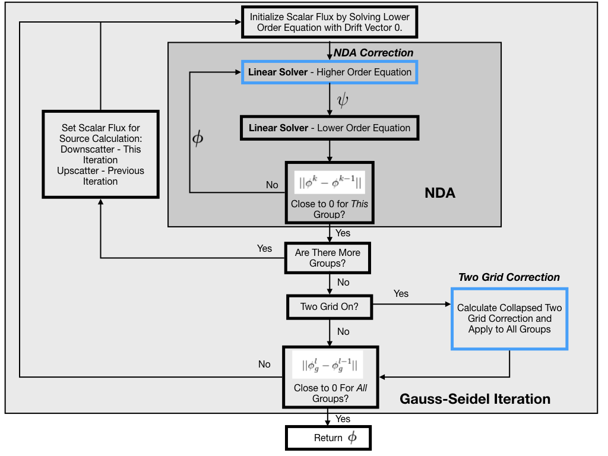

<figure>
  
  <figcaption>
  Gallo: Python based radiation transport code.
  </figcaption>
</figure>

Gallo is a 2D, finite element, radiation transport simulation code.

# Usage
Gallo requires three input files and one run file to run a problem. An example problem setup is given in 'experiments/example-no-scattering'

### Node Files
This file stores all nodal information for the geometry and has the extension '.node'. Example node files were generated with [Triangle](https://www.cs.cmu.edu/~quake/triangle.html). A sample poly input for triangle is available in 'docs/sample_inputs'.

### Element File
This file stores all element information for the geometry and has the extension '.ele'. Example ele files were generated with
[Triangle](https://www.cs.cmu.edu/~quake/triangle.html). If you are generating element files with Triangle for use in multimaterial problems, be sure to specify regional attributes to indicate the placement of materials.

### Material File
This file stores cross-sections and other material data and has the extension '.mat'. A sample material file is available in 'docs/sample_inputs'.

### Run File
This file gathers problem details and excutes solution. The user must specify the paths for all input files, an equation type (supported types are 'NDA', 'TGNDA', 'SAAF', and 'Diffusion'), a source, and a problem name. The run command will output a numpy array and plots of scalar flux data.

# Architecture

